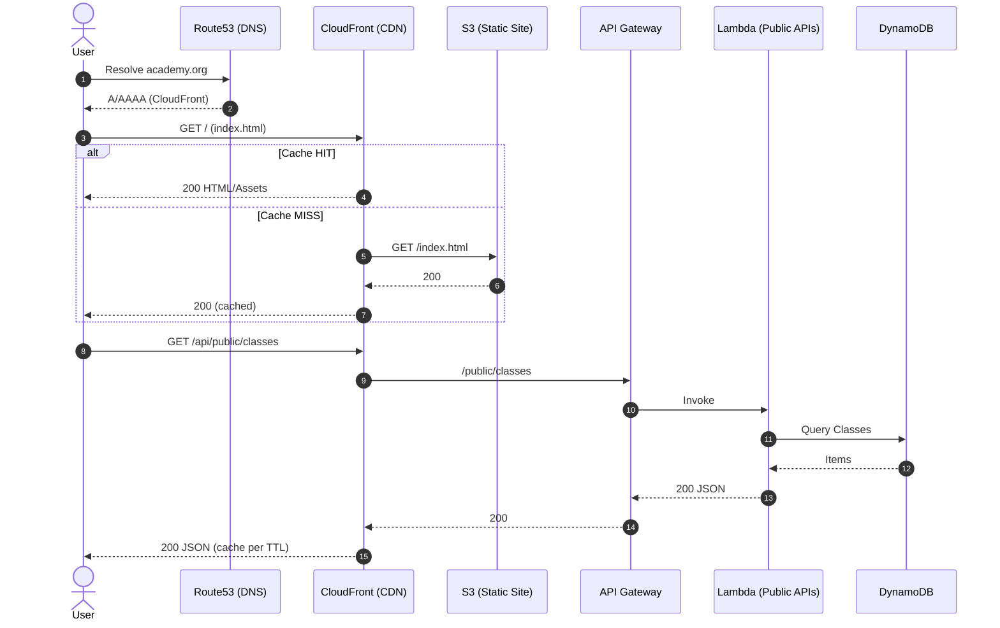
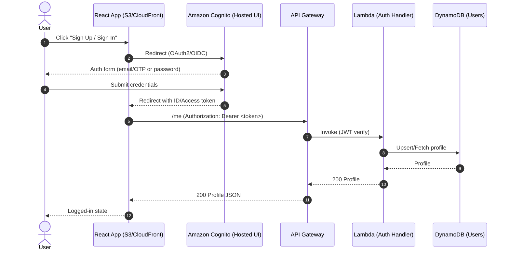
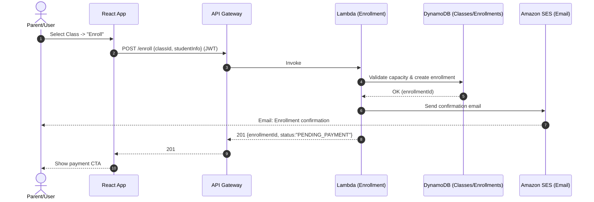
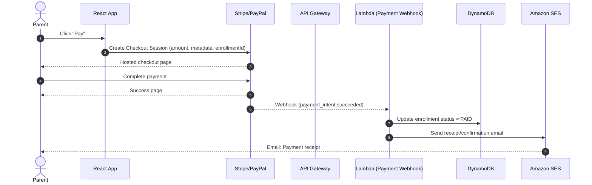
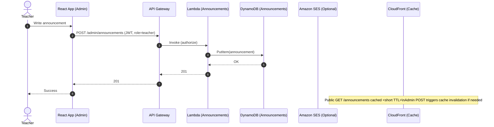
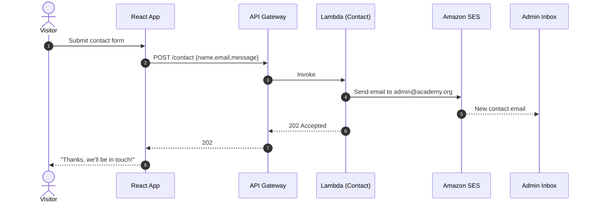
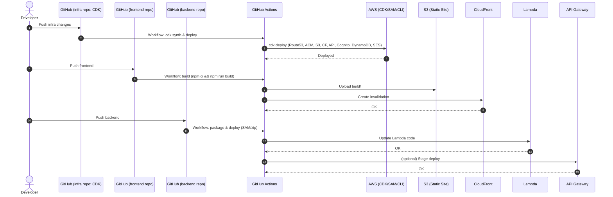
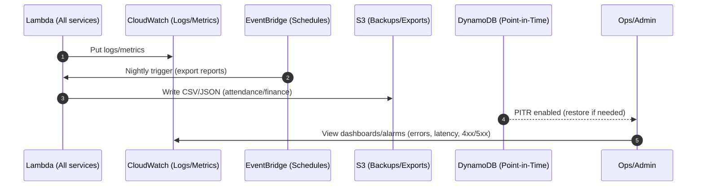

# Greater San Diego Tamil Academy — System Sequence Diagrams

A consolidated set of Mermaid sequence diagrams for our low-cost, serverless AWS architecture (S3+CloudFront frontend, API Gateway + Lambda, Cognito, DynamoDB, SES, Stripe/PayPal).

## Table of Contents
- [1) Public page load (cached via CloudFront)](#1-public-page-load-cached-via-cloudfront)
- [2) Sign‑up + sign‑in (Cognito Hosted UI)](#2-sign-up--sign-in-cognito-hosted-ui)
- [3) Enrollment flow (student joins a class)](#3-enrollment-flow-student-joins-a-class)
- [4) Payment (Stripe or PayPal) and reconciliation webhook](#4-payment-stripe-or-paypal-and-reconciliation-webhook)
- [5) Teacher posts announcement (secured API)](#5-teacher-posts-announcement-secured-api)
- [6) Contact‑us form (serverless email)](#6-contact-us-form-serverless-email)
- [7) CI/CD (separate repos; minimal‑cost pipeline)](#7-cicd-separate-repos-minimal-cost-pipeline)
- [8) Backups & logs (observability and cost control)](#8-backups--logs-observability-and-cost-control)

> Tip: GitHub and many Markdown tools render Mermaid automatically. If needed, enable Mermaid support in your viewer (e.g., VS Code + Markdown Preview Mermaid support).

---

## 1) Public page load (cached via CloudFront)

---

## 2) Sign‑up + sign‑in (Cognito Hosted UI)

---

## 3) Enrollment flow (student joins a class)

---

## 4) Payment (Stripe or PayPal) and reconciliation webhook

> Note: If using PayPal, adapt event names/metadata accordingly. Keep webhook handler idempotent.

---

## 5) Teacher posts announcement (secured API)

---

## 6) Contact‑us form (serverless email)

---

## 7) CI/CD (separate repos; minimal‑cost pipeline)

> Cost note: GitHub Actions free tier is sufficient for low-volume deployments. Avoid always-on build servers.

---

## 8) Backups & logs (observability and cost control)

> Enable DynamoDB Point-in-Time Recovery (PITR). Use metric filters/alarms sparingly to avoid costs.

---

### Notes
- **Separate repos:** infra (CDK), frontend (React), backend (Lambdas). Keep IAM least-privilege across pipelines.
- **Cost minimization:** Prefer CloudFront caching, DynamoDB on-demand, SES in-region, and idempotent Lambdas. Avoid NAT gateways.
- **Security:** Use Cognito groups/roles, API Gateway authorizers, and parameterize secrets in SSM Parameter Store.
